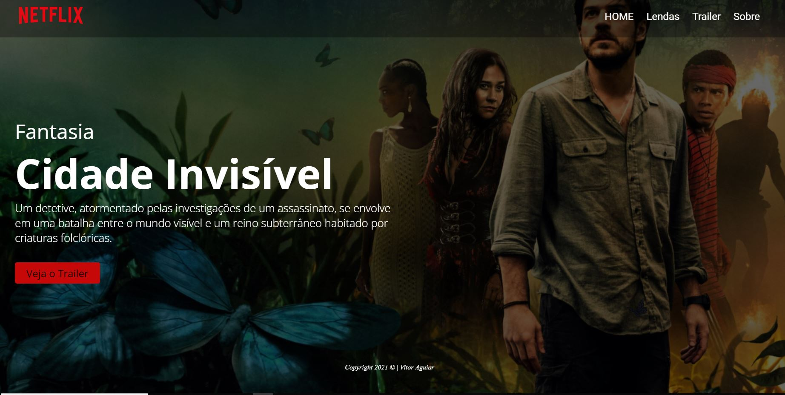

# Cidade-invisivel

Site sobre a série Cidade incisível da Netflix, com fins didáticos, para o curso de desenvolvimento de sistemas do [SENAI Jandira](https://jandira.sp.senai.br/), sobre orientação do professor [Fernando Leonid](https://github.com/fernandoleonid).

## Objetivo do exercício

Realizar o desenvolvimento do site sobre Cidade Invisível a partir de um planejamento feito no figma.

## Website

A galeria pode ser acessada pelo link: [vitoraguiarc](https://github.com/vitoraguiarc/cidade-invisivel)

## Tecnológias

- HTML5
- CSS3
- VSCODE

## Screenshot

